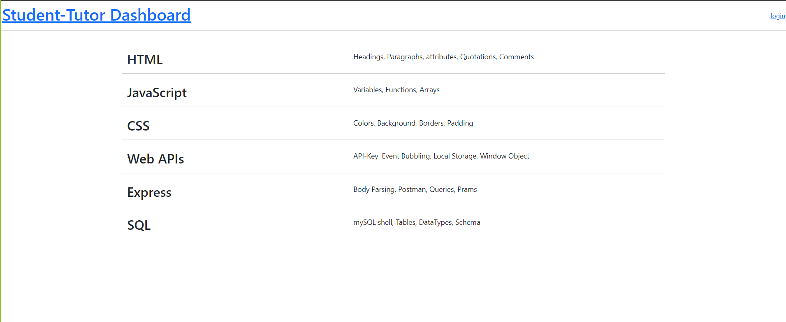
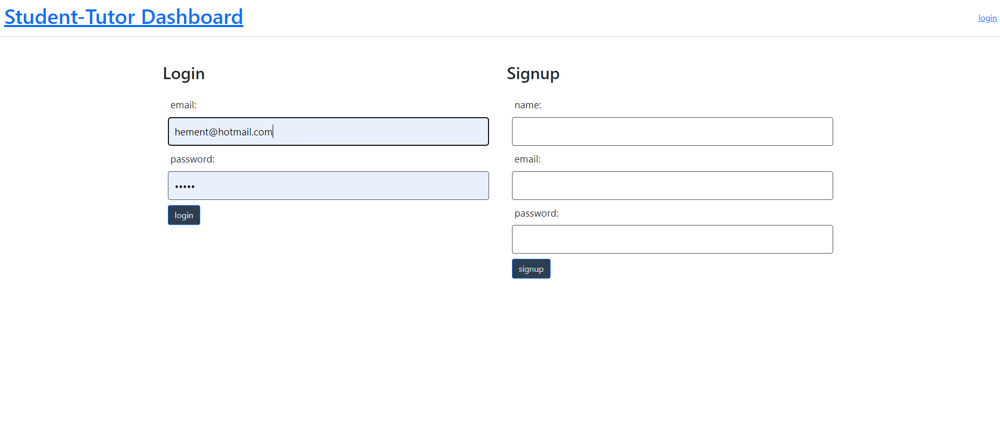
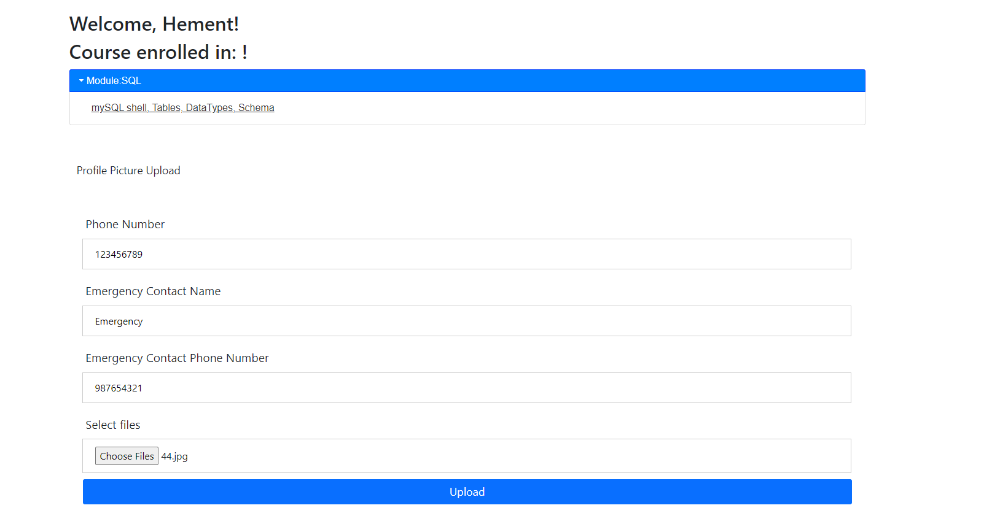
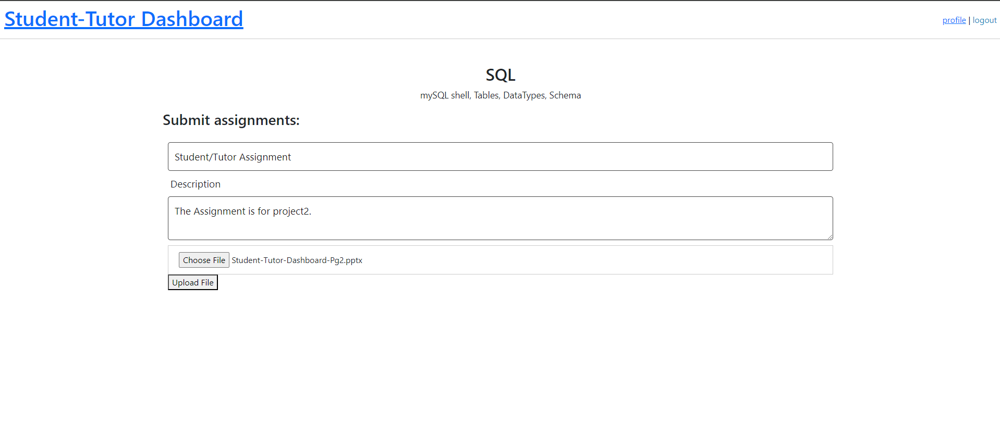
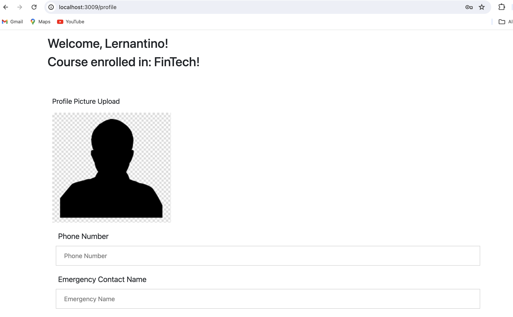
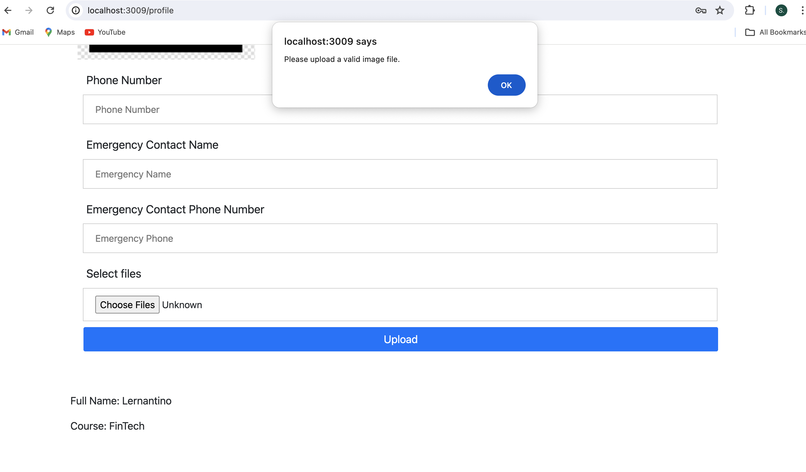

# project2

- A dashboard for students.
- A user dashboard created using Node.js, Express.js, MySQL, Sequelize ORM, Handlebars.js, Multer, Sharp in MVC folder architecture.

## User Stories

- As a user, I want to be able to sign up.
- As a user I want to be able to login in, view and/or update my contact information, my profile picture, projects and upload a file. 

## Description

- The motivation for this project was to create an interactive website where users can access their dashboard, see their projects, view or update their contact information, view or uplaod a profile picture, view their module and upload a file. 
- Challenges were faced when implementing a POST route to allow users to be able to create a new project and post it to the page. 
- As well, when implementing new technologies, Multer and Sharp, many challenges were faced, especially wiht Multer. Issues arose with documentation and resoucres that were used since many varied, from resource to resource, the code
- Time was also a huge challenge faced and caused a lot of limitations to the outcome of the final project. 
- For future development we would like add user interactivity 
- This project was created using using Node.js, Express.js, MySQL, Sequelize 6.3.5, Handlebars.js 5.2.0, Multer 1.4.5-lts.1, Sharp 0.33.3 in MVC architecture.

## Installation

- Install Node.js, Express.js, MySQL, Sequelize, Multer, Sharp.

## Usage

- To access this application the user will go to the webpage and their dashboard will load. 
- Log in or sign up
- Update your user contact inforamtion and/or upload a photo.
- Select a module and upload a file. 

- Screenshots showing usage of this project 

## License 

- MIT License

## Credits

Garg, P. [Piyush Garg]. (2023, February 6). Uploading files with node.js and multer [Video]. YouTube. https://www.youtube.com/watch?v=WqJ0P8JnftI

Glover, D. (2021, May 18). Implementing multer using a controller/model pattern typescript. Medium. https://iamdanielglover.medium.com/implementing-multer-using-a-controller-model-pattern-typescript-4212392cf77c

Megida, D. (2022, March 10). Multer: Easily upload files with node.js and express. LogRocket. https://blog.logrocket.com/multer-nodejs-express-upload-file/
PedroTech. (2020, December 24). Uploading images with multer, node.js and express.js [Video]. YouTube. https://www.youtube.com/watch?v=wIOpe8S2Mk8

NPM. (n.d.). Sharp (0.33.3) https://www.npmjs.com/package/sharp

Quick, J. [James Q. Quick]. (2023, November 28). How to upload files in node.js using express and multer [Video]. YouTube. https://www.youtube.com/watch?v=i8yxx6V9UdM

Stackoverflow. (n.d.). Express: How do i Use sharp with multer? https://stackoverflow.com/questions/64344066/express-how-do-i-use-sharp-with-multer

University of Toronto. (2023). Coding Boot Camp [Source Code].

Zanini, A. (2023, March 13). Blob data type: Everything you can do with it. DBVIS. https://www.dbvis.com/thetable/blob-data-type-everything-you-can-do-with-it/#:~:text=BLOB%20stands%20for%20“Binary%20Large,images%2C%20video%2C%20and%20audio.